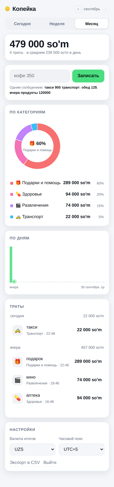
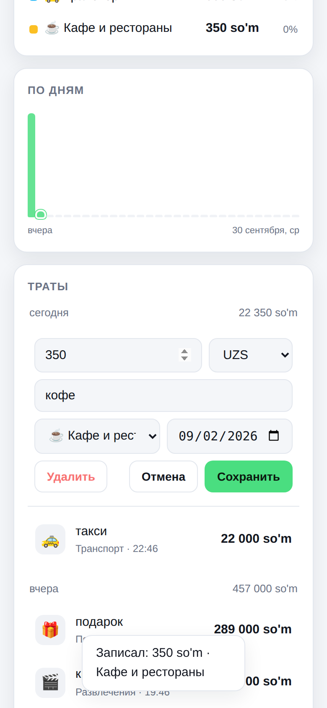
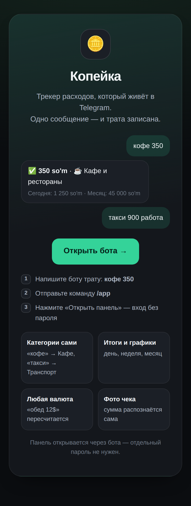

# 🪙 Копейка — трекер расходов в Telegram

Пишете боту «кофе 350» — трата записана. Никаких форм и регистраций: **Telegram и есть аккаунт**.
Веб-панель показывает, куда уходят деньги: по дням, по категориям, итоги за неделю и месяц.
Вход в панель — через того же бота, отдельного пароля нет.

| | |
|---|---|
| 🤖 Бот | `https://t.me/…` — *подставьте адрес своего бота* |
| 📊 Панель | `https://…` — *подставьте адрес деплоя* |
| 🎬 Видео | `https://…` — *ссылка на демо 2–3 минуты* |

<p align="center">
  
  
  
</p>

<p align="center"><i>Тёмная и светлая темы, мобильная вёрстка, графики нарисованы вручную — без сборки и внешних библиотек.</i></p>

---

## Что умеет

**Ввод — одно сообщение боту**

| Сообщение | Что получится |
|---|---|
| `кофе 350` | 350 · ☕ Кафе и рестораны |
| `такси 900 работа` | 900 · 🚕 Транспорт, описание «такси работа» |
| `шаверма 25000 продукты` | категория указана словом — 🛒 Продукты |
| `обед 12$` | трата в долларах, в итогах пересчитается в вашу валюту |
| `продукты 12к` | 12 000 |
| `вчера аптека 45000` | запись задним числом |
| 📷 фото чека | сумма распознаётся автоматически *(если включён ИИ)* |

Несколько трат — одним сообщением, по одной в строке:

```
такси 700 рублей до центра
459 завтрак с лимонадом
1054 кофе и десерт
1700 продукты
```

Валюта, названная в одной строке, относится ко всему сообщению — бот запишет
четыре траты в рублях и пересчитает их в вашу валюту. Строки, которые не
поддались правилам («два кофе по 15 тысяч»), понимает ИИ, если задан
`ANTHROPIC_API_KEY`; без ключа бот просто попросит написать сумму цифрами.

Категория определяется по описанию (словарь ключевых слов на русском и английском) или задаётся
словом в том же сообщении. Ошиблись — под каждой тратой кнопки **🗂 Категория · ✏️ Исправить · 🗑 Удалить**.

**Первый запуск** — `/start` спрашивает страну (🇹🇯 Таджикистан · 🇷🇺 Россия · 🇰🇿 Казахстан)
и валюту итогов: часовой пояс и валюта настраиваются двумя касаниями, без ввода цифр.

**Итоги в боте** — `/today`, `/week`, `/month`: сумма, разбивка по категориям и текстовые полоски.

**Веб-панель** — итоги за сегодня/неделю/месяц, кольцевая диаграмма по категориям, столбики по дням,
список трат по дням, быстрый ввод той же строкой, правка и удаление, переключение месяцев.
Мобильная вёрстка, светлая и тёмная тема.

**Бонусы, которые уже работают**

- 🧠 **понимание живой речи** — строки, которые не разбираются правилами, читает Claude;
- 📷 **распознавание чеков по фото** — сумма, магазин и категория (Claude Vision, включается ключом API);
- 💱 **несколько валют** — трата в любой валюте, итоги в базовой;
- 📄 **экспорт в CSV** — `/export` в боте и кнопка в панели (открывается в Excel и Google Sheets);
- 🎯 **лимиты по категориям** — `/limit кафе 500000`, предупреждение в боте на 80% и при превышении;
- 🕒 **часовой пояс пользователя** — «сегодня» считается по вашему времени, а не по времени сервера.

Общие бюджеты на двоих пока не сделаны — данные строго персональные.

---

## Быстрый старт локально

Нужен только Node.js 20+ (проверено на 22). Ничего глобально ставить не надо.

```bash
git clone https://github.com/alijon26062006-bit/ali.me.git
cd ali.me
npm install

cp .env.example .env
# впишите BOT_TOKEN от @BotFather и любой SESSION_SECRET
npm start
```

Бот сразу заработает в режиме long polling, панель поднимется на <http://localhost:3000>.
Напишите боту трату, затем `/app` — он пришлёт одноразовую ссылку входа в панель.

Полезное:

```bash
npm test          # 44 теста: парсер, даты, API, бот
npm run seed 777  # демо-данные и ссылка входа для пользователя с Telegram ID 777
npm run dev       # автоперезапуск при изменениях
```

## Переменные окружения

Все секреты — только в `.env` (он в `.gitignore`) или в переменных окружения хостинга.
В репозитории лежит лишь `.env.example` с плейсхолдерами.

| Переменная | Обяз. | По умолчанию | Зачем |
|---|:--:|---|---|
| `BOT_TOKEN` | да | — | токен бота от [@BotFather](https://t.me/BotFather) |
| `SESSION_SECRET` | да* | случайный при старте | подпись cookie-сессий; без него сессии слетают при рестарте |
| `BOT_USERNAME` | нет | — | имя бота без `@` для кнопки «Открыть бота» |
| `PUBLIC_URL` | нет** | `http://localhost:PORT` | публичный https-адрес панели: ссылки входа, Mini App, вебхук |
| `PORT` | нет | `3000` | порт веб-панели |
| `DB_PATH` | нет | `./data/kopeyka.db` | файл SQLite |
| `DEFAULT_CURRENCY` | нет | `UZS` | базовая валюта новых пользователей |
| `DEFAULT_TZ_OFFSET` | нет | `300` | часовой пояс в минутах от UTC (300 = UTC+5) |
| `RATES` | нет | встроенные | свои курсы валют, JSON: сколько единиц валюты в долларе |
| `USE_WEBHOOK` | нет | `0` | `1` — вебхук вместо long polling (нужен `PUBLIC_URL`) |
| `WEBHOOK_SECRET` | нет | — | секрет заголовка `X-Telegram-Bot-Api-Secret-Token` |
| `SESSION_DAYS` | нет | `30` | срок жизни сессии панели |
| `ANTHROPIC_API_KEY` | нет | — | включает распознавание чеков и разбор сложных сообщений |
| `OCR_MODEL` | нет | `claude-opus-5` | модель для распознавания |

\* обязателен в production. \*\* обязателен, если включён вебхук или нужен вход через Mini App.

## Деплой одной командой

На чистом сервере (Ubuntu/Debian/CentOS, нужен root или sudo):

```bash
curl -fsSL https://raw.githubusercontent.com/alijon26062006-bit/ali.me/claude/charming-davinci-jhnk9o/scripts/deploy.sh | bash
```

Скрипт сам разберётся, как отдавать панель наружу: если порты 80 и 443 свободны —
поднимет Caddy с автоматическим HTTPS; если на сервере уже работает **nginx** —
добавит ему сайт и попросит сертификат у certbot; если домена нет — поднимет панель
по IP на первом свободном порту. Занятые чужими проектами порты не трогает.

Скрипт сам спросит всё, что нужно:

- **токен бота** от [@BotFather](https://t.me/BotFather) — сразу проверяется через Telegram,
  имя бота определяется автоматически;
- **домен панели** — если ввести, поднимется HTTPS с сертификатом Let's Encrypt и вебхук;
  если нажать Enter, панель будет доступна по IP, а бот пойдёт на long polling;
- **валюта**, **часовой пояс** и, по желанию, **ключ Anthropic API** для распознавания чеков.

Дальше он всё делает сам: ставит Docker, забирает код, генерирует `SESSION_SECRET`
и `WEBHOOK_SECRET`, пишет `.env` с правами 600, собирает и запускает контейнеры,
дожидается ответа `/healthz` и печатает ссылки на бота и панель.

С доменом нужны только A-запись на IP сервера и открытые порты 80 и 443. После установки
выполните в [@BotFather](https://t.me/BotFather) `/setdomain` — тогда панель будет
открываться прямо внутри Telegram.

Для автоматизации те же значения передаются флагами — тогда вопросов не будет:

```bash
curl -fsSL https://raw.githubusercontent.com/alijon26062006-bit/ali.me/claude/charming-davinci-jhnk9o/scripts/deploy.sh \
  -o deploy.sh && bash deploy.sh --token 8123456789:AAH... --domain kopeyka.mysite.ru
```

Опции: `--proxy caddy|nginx|none`, `--anthropic-key`, `--currency USD`, `--tz-offset 180`,
`--port 8080`, `--dir /srv/kopeyka`
(`--help` — полный список). Повторный запуск той же команды = обновление: база и секреты
сохраняются. Логи — `cd /opt/kopeyka && docker compose logs -f app`.

## Если что-то не работает

Диагностика одной командой — проверит контейнеры, ответ приложения, токен,
вебхук, DNS, порты и сертификат, и подскажет, что чинить:

```bash
curl -fsSL https://raw.githubusercontent.com/alijon26062006-bit/ali.me/claude/charming-davinci-jhnk9o/scripts/doctor.sh | bash
```

Скрипт ничего не меняет и не печатает токен. Частые причины молчания бота:
не выпущен сертификат (нет A-записи или закрыты порты 80/443), тот же токен
занят другой запущенной копией бота, либо у бота остался вебхук от прошлой
установки, когда включён polling — обо всём этом doctor скажет прямо.

## Другие способы деплоя

Приложение — один процесс: веб-панель и бот живут вместе, данные в SQLite-файле.
Нужен хостинг с постоянным диском (Render, Railway, Fly.io, любой VPS).

**Docker Compose вручную:**

```bash
git clone -b claude/charming-davinci-jhnk9o https://github.com/alijon26062006-bit/ali.me.git
cd ali.me && cp .env.example .env   # заполнить BOT_TOKEN, PUBLIC_URL, SESSION_SECRET, DOMAIN
docker compose --profile tls up -d --build   # без домена: docker compose up -d --build
```

С доменом порт приложения наружу не публикуется — к нему ходит только Caddy
по внутренней сети. Без домена `deploy.sh` добавляет `docker-compose.override.yml`
с публикацией порта, чтобы панель открывалась по IP.

**Только контейнер приложения, без Caddy:**

```bash
docker build -t kopeyka .
docker run -d --name kopeyka -p 3000:3000 \
  -v kopeyka-data:/data \
  -e BOT_TOKEN=... -e BOT_USERNAME=... \
  -e SESSION_SECRET=... -e PUBLIC_URL=https://ваш-домен \
  -e USE_WEBHOOK=1 -e WEBHOOK_SECRET=... \
  kopeyka
```

**Render:** в репозитории есть `render.yaml` — New → Blueprint → выбрать репозиторий.
`SESSION_SECRET` и `WEBHOOK_SECRET` генерируются автоматически, `BOT_TOKEN`, `BOT_USERNAME`
и `PUBLIC_URL` вписываются в дашборде. Диск монтируется в `/data`.

**Polling или вебхук.** По умолчанию long polling — работает даже без домена.
С `USE_WEBHOOK=1` приложение само зарегистрирует вебхук на `PUBLIC_URL/telegram/webhook`
и будет проверять секретный заголовок. Важно: один и тот же токен нельзя использовать
в двух запущенных копиях — Telegram отдаёт апдейты только одной.

**Mini App (необязательно, но приятно).** Если `PUBLIC_URL` начинается с `https://`,
кнопка «📊 Панель» открывает панель прямо внутри Telegram, а вход происходит автоматически
по подписанным `initData`. В [@BotFather](https://t.me/BotFather) достаточно задать домен: `/setdomain`.

## Как устроено

```
src/
  index.js      запуск: веб-сервер + бот (polling или вебхук)
  config.js     переменные окружения в одном месте
  db.js         SQLite-схема и запросы (все — с фильтром по user_id)
  parse.js      разбор «кофе 350», «такси 900 работа», «12$», «12к», «вчера»
  categories.js категории и словари ключевых слов
  money.js      валюты, форматирование, пересчёт по курсам
  time.js       локальные дни, недели и месяцы в часовом поясе пользователя
  service.js    добавление и правка трат, сводки, лимиты, CSV
  bot.js        команды, кнопки, диалоги
  telegram.js   тонкий клиент Bot API на fetch (без зависимостей)
  auth.js       одноразовые ссылки входа, подписанные сессии, проверка initData
  ocr.js        распознавание чеков (Claude Vision), включается ключом
  smart.js      разбор сообщений, с которыми не справились правила
  server.js     REST API и раздача панели
public/         панель: один HTML, один JS, один CSS — без сборки и CDN
test/           44 теста на node:test
scripts/        deploy.sh — установка одной командой, doctor.sh — диагностика, seed.js — демо-данные
```

Зависимости: `express`, `better-sqlite3`, `dotenv` и (только для OCR) `@anthropic-ai/sdk`.
Фронтенд — ванильный JS, графики нарисованы вручную: ни сборки, ни внешних библиотек.

## Приватность и безопасность

- **Чужие траты увидеть нельзя.** Каждый SQL-запрос фильтруется по `user_id`; попытка
  открыть или удалить чужую запись отдаёт 404. Это покрыто тестами.
- **Вход без пароля.** Бот выдаёт одноразовую ссылку (живёт 15 минут, сгорает после первого
  открытия) либо панель открывается как Mini App с проверкой подписи `initData`.
  Сессия — cookie `HttpOnly`, `SameSite=Lax`, подписанная HMAC-SHA256.
- **Секретов в репозитории нет.** Токен и ключи берутся только из окружения,
  `.env` и файлы базы в `.gitignore`.

## Лицензия

MIT — см. [LICENSE](LICENSE). Весь код написан для этого проекта; сторонних фрагментов без
указания источника в нём нет.
